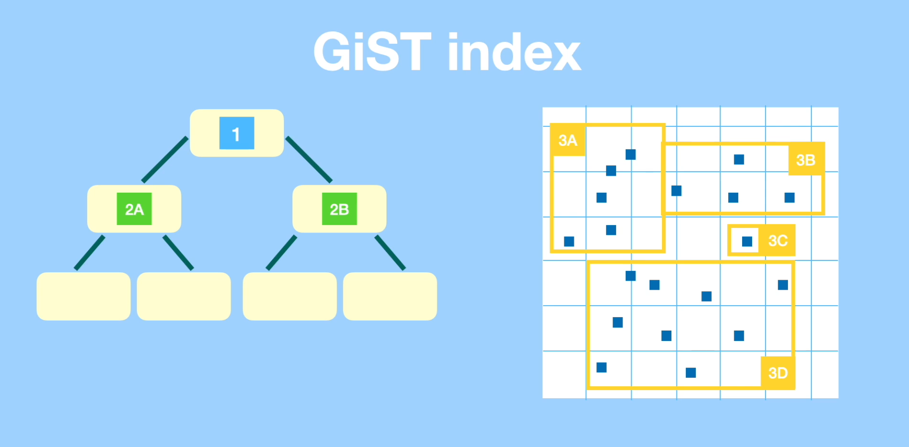
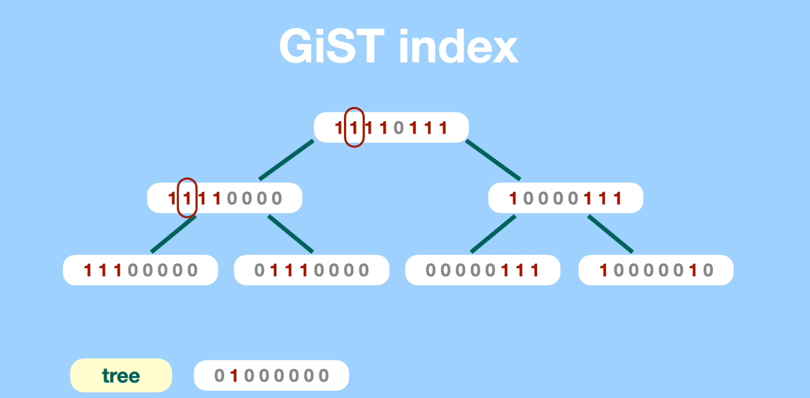
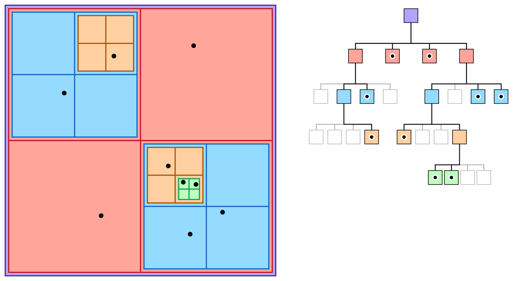
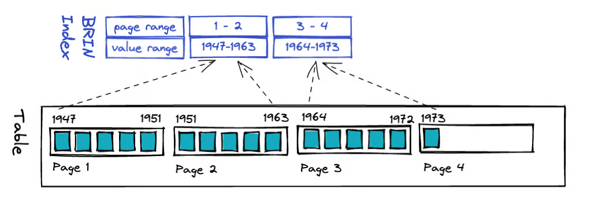

# The Anatomy of an Index

## Overview of Index Types

* [Main source](https://www.postgresql.org/docs/current/indexes-types.html)


### B-Tree
* The default index used as it works on all primitive data types.
* Can handle the  "<  <=  =  >=  >" operations.
* Name is a bit misleading as it is not just a balanced tree, but a balanced tree with a double linked list at its base (more details later).


### Hash
* Store a 32-bit hash code derived from the value of the indexed column. Hence, such indexes can only handle simple equality comparisons.
* Its job can be done by the more versatile B-Tree index, but Hash indexes can be slightly faster for equality operations in some specific circumstances.

### GiST (Generalized Search Tree)
<div align="center">
  
  
</div>

* [A quick 8 minute introduction](https://www.youtube.com/watch?v=zw4-Hpm7ysk)
* Is a framework for building indexes on complex data types: spatial coordinates (pictured on the left), trees, text (for searching, pictured on the right using signatures which hint if a word *might* be present but do not 100% guarantee it due to collisions), etc.
* Some GiST indexes can be found [here](http://www.sai.msu.su/~megera/postgres/gist/).

### SP-GiST (Space-Partitioned GiST)

<center></center>

* SP-GiST supports partitioned search trees, which facilitate development of a wide range of different non-balanced data structures, such as quad-trees (pictured above), k-d trees, and radix trees (tries).
* The common feature of these structures is that they repeatedly divide the search space into partitions that need not be of equal size. Searches that are well matched to the partitioning rule can be very fast.

### GIN (Generalized Inverted iNdex)

* Read more [here](https://pganalyze.com/blog/gin-index)
* Used to index data types with multiple components. For example:
  * **Text** -- A prerequisite is having to convert text in its components by using `to_tsvector`, which tokenizes (splits into words) and converts to lexemes (e.g. running -> run).
    ```sql
    SELECT to_tsvector('english', 'Running running run used to run home the ran for president');
    -----------------------------------------------------
    'home':7 'presid':11 'ran':9 'run':1,2,3,6 'use':4
    ```
  * **JSONB** -- The preferred way of indexing JSONB data.
* The **inverted** part of the name of the index comes from the fact that the index stores multiple references to the same row of data (one for each component). This is in contrast to B-Tree indexes which only have one reference to each row. The idea is that you can search for each component separately and each will bring you back to the original row of data.

### BRIN (Block Range INdexes)

<center></center>

* Read more [here](https://www.crunchydata.com/blog/postgres-indexing-when-does-brin-win).
* Can handle the  "<  <=  =  >=  >" operations (just like B-Trees).
* Are very lightweight (size on disk & write overhead).
* Require a strong correlation between the order of the values of the column it indexes and the physical location on disk of the data (page number). Thus it is well suited for creation dates, timestamps, incremental identifiers, etc.
* They are useful for very large tables with many insert operations per second.
